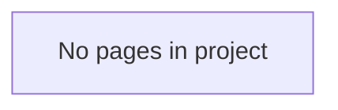

# test4 COP

*description of the COP*

**COP timeframe** 2025-12-29 - 2026-04-06

## Information Architecture

## Overview

This repository was created via the **Design Assistant**.  
It contains the template files and in-scope pages needed to get started.

GitHub Pages: [https://proto-cra.github.io/test4](https://proto-cra.github.io/test4)

---
## Update procedures

Add information on how to manage the repo here.

---
## Design phase roadmap:

- [x] Initial content inventory and repo setup
- [ ] Prototype: co-design navigation and content
- [ ] SME review and accuracy check
- [ ] Validation usability testing (including accessibility review)
- [ ] Refine prototype (if required)
- [ ] Spot check usability (if required)

**Updated:**  2026-01-12
